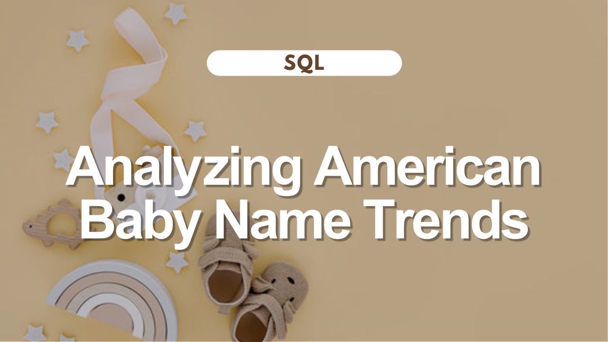

# Analyzing American Baby Name Trends

What makes a name timeless or trendy? In this project, I use categorization and ranking techniques to explore 101 years of American baby name tastes. Project provided by DataCamp, data from the U.S. Social Security Administration.

**[Click here](https://github.com/jessicabohannon/Analyzing-American-Baby-Name-Trends/blob/main/notebook.ipynb)** to view the project.

Skills used:
* CASE WHEN statements
* Pattern matching using the LIKE operator
* Subqueries
* Common table expressions (CTEs)
* Window functions
* Joining data
* Aggregate functions
* Filtering grouped data
* Sorting, filtering, and grouping
